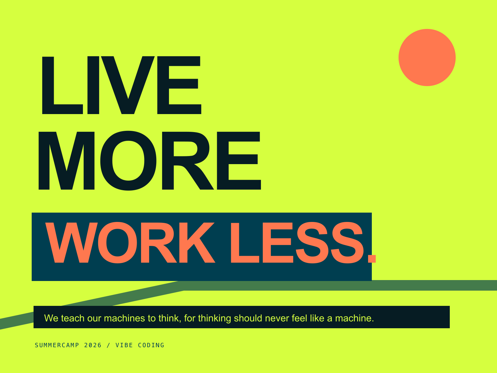

# SummerCamp-2026
2026 Summer Camp — Vibe Coding course materials and showcase

## 课程社区

在这里，问题可以被看见，经验可以被复用，想法也能找到伙伴。欢迎每位同学参与互助！

| 想做什么？ | 入口 |
| --- | --- |
| 🙋 遇到课程或项目问题 | [提问答疑](https://github.com/DaSE-VibeCoding/SummerCamp-2026/issues/new?template=course-q-and-a.yml) |
| 👋 初次来这里，想认识大家 | [进入 🌟 破冰认识](https://github.com/DaSE-VibeCoding/SummerCamp-2026/discussions/categories/icebreaker) |
| 🧩 分享或发现好用的 Agent Skill | [Skill 广场](https://github.com/DaSE-VibeCoding/SummerCamp-2026/discussions/categories/skill-square) · [精选索引](skills/README.md) |
| 🤝 想认识伙伴、一起组队 | [寻找队友](https://github.com/DaSE-VibeCoding/SummerCamp-2026/discussions) |
| 🚀 已有项目，正在招募成员 | [发布招募](https://github.com/DaSE-VibeCoding/SummerCamp-2026/discussions) |

开始前，请先搜索类似讨论；保持友善；问题解决后记得确认关闭；不要公开密码、Token、学号、电话等敏感信息。详细规则见[社区准则](docs/community-guidelines.md)。
